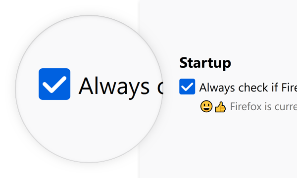
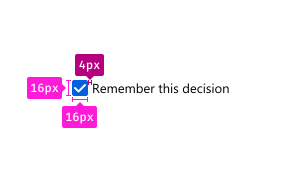
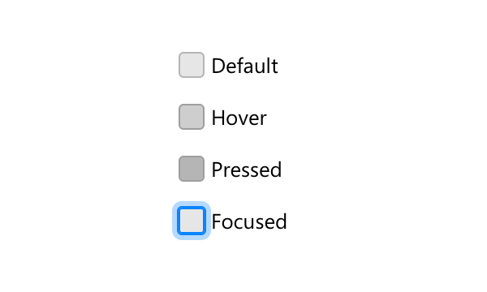

A checkbox is used to choose between two opposite states, often to select/deselect items or enable/disable actions.

Toggles provide an alternative UI for the same use cases and are often used on mobile.

## Usage

Use checkboxes to provide a binary choice. For example to offer a choice about performing an action or not. It is considered “on” when it is checked, and “off” when it’s not.

## Combination

A checkbox can be used as a single element, or it can be combined into a list, or nested list of elements to pick multiple from.

### Single

Use one checkbox to offer one binary choice.

### Group

Group checkboxes to convey a set of choices are related.

### Nested Group

Nest checkboxes to convey that some options are only available if the parent option is selected.

> See [Nesting](../patterns/nesting.html) for more info on how to nest elements.

## Style

A checkbox consists of a part to indicate its state and a label to describe the binary choice it represents.

### Indicator & Label

Use the indicator to show whether the checkbox is checked (“on”) or not (“off”).

Use the label to make the action clear and convey that it is a binary choice.

### Dimensions

Corner Radius: `2px`

Height: `16px`

Width: `16px`

Horizontal Padding: `4px`

### Text and Color

Text: [Body 10](../visuals/typography.html#scale)

Text Color: Grey 90 `#0c0c0d`

## Behaviors

### On / Off

#### Checked (On):

Icon: [Checkbox-Check](../images/components/checkboxes/checkbox-check-16.svg)

Background Color: Blue 60 `#0060df`

#### Unchecked (Off):

Background Color: Grey 90 a10 `rgba(12, 12, 13, 0.1)`

Border: 1px Grey 90 a30 `rgba(12, 12, 13, 0.3)`

### Clicktarget

A checkbox can be toggled by clicking on the area of its checkbox as well as its label. Usually the clicktarget extends to the same width for each element in a collection of checkboxes. This results in a click target that extends beyond the label, for all elements shorter than the longest.

Clicking a checkbox triggers the action on release of the click. If, during the click, the mouse is moved off of the checkbox, no action is triggered.

### Disabled

40% Opacity

Can not be interacted with nor focused.

### Interaction

#### Checked

Background Color:

Default: Blue 60 `#0060df`

Hover: Blue 70 `#003eaa`

Pressed: Blue 80 `#002275`

##### Focused:

Border: none

Box Shadow: `0 0 0 1px #0a84ff inset, 0 0 0 1px #0a84ff, 0 0 0 4px rgba(10, 132, 255, 0.3)`

#### Unchecked

Background Color:

Default: Grey 90 a10 `rgba(12, 12, 13, 0.1)`

Hover: Grey 90 a20 `rgba(12, 12, 13, 0.2)`

Pressed: Grey 90 a30 `rgba(12, 12, 13, 0.3)`

##### Focused:

Border: none

Box Shadow: `0 0 0 1px #0a84ff inset, 0 0 0 1px #0a84ff, 0 0 0 4px rgba(10, 132, 255, 0.3)`

## Copy Rules

* Use the imperative voice for checkbox labels.

* Do not use terminal punctuation for checkbox labels.

* Maintain parallel construction for lists of related checkbox labels.
