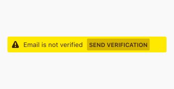

## Usage

Warnings alert users prior to actions that may be damaging or harmful, without restricting them from taking an action. Warnings are generally used for issues that occur because of external factors (e.g., arriving at a dangerous website, or using a site that is causing Firefox to slow down) and should be used sparingly as part of a planned interaction. (It is ok to ask users to confirm decisions, but those confirmations should usually not take the form of a warning.)

Warnings support users with the content of the messages (text, icons, color) as well as the context (where on the screen and when in the user flow the messages appear).

We distinguish between two different categories of warnings:

* Generic warnings
* High visibility warnings

## Generic warnings



## High visibility warnings



## Style

### Icon

The icon used to indicate errors is [an exclamation mark enclosed within a triangle](http://design.firefox.com/icons/viewer/#warning).

{:width="100%"}

### Color

[Yellow](../visuals/color.html#yellow) is the dedicated color for warning states. Warning text should be highly legible, with noticeable contrast against its background color.

In the rare case of a high visibility warning, use [red](../visuals/color.html#yellow) to indicate the seriousness of the warning.

### Copy Rules

A good warning message is immediately pertinent and actionable.

* Alert users to a situation or possible issue as it arises, even if it doesn't require immediate action.

* Include information that will help users prevent an immediate issue and avoid similar issues in the future.

* Rely on color and iconography to alert users to the fact of the warning, and use the limited text of the warning to explain the issue and available user actions. Avoid using the word **warning** or **caution** in the copy. When used correctly, the warning icon is enough to communicate that users should proceed with caution.