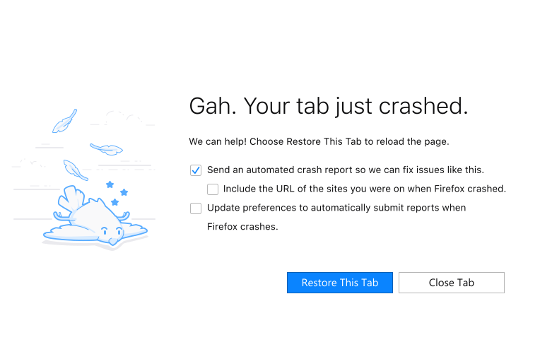

Firefox illustrations are approachable, supportive, and whimsical.

## Usage

Illustrations are a visually and emotionally powerful tool. So use them sparingly and carefully identify the right situations for them. If an illustration is used only as a decorative element, it may lose its communicative power and distract people. 

Use illustration to encourage users who are frustrated, are lost, or have had something go wrong. Don't use illustration if the user is in danger. 

<figcaption markdown="1">In pages like *error pages*, the illustration may bring a smile to the user's face
</figcaption>

Use illustration to **introduce** and **explain** a product or feature. This can be especially helpful for new, misused, or neglected features.

<figcaption markdown="1">During *onboarding*, illustrations are used to introduce the user to the product's features
</figcaption>

Use illustration to help people **understand** content by **exemplifying** it. This is especially useful in text-heavy components like announcements.

<figcaption markdown="1">In pages like *about:rights*, the whimisical illustration encourages to read
</figcaption>

Use illustration to **congratulate** or **celebrate** with people.

<figcaption markdown="1">A whimisical unicorn celebrates our contributors in the *about:credits* page
</figcaption>

## Appearance

Firefox illustrations are created for specific contexts and purposes. They should not be used in any other way without consulting the [Content Team](https://github.com/FirefoxUX/photon/issues "Request a new illustration by filling an issue") first.

### Background

Most Firefox illustrations are built for a background of Grey 10 `#f9f9fa`.

### Transparency

Firefox illustrations are built to work without additional adjustments to their opacity.

### Dimension

Firefox illustrations should not use more than 40% of the available space, and not less than 20%. They should not be stretched or distorted.

### Customization

Firefox illustrations should not be altered in any way, nor should they be combined with any other graphics, without the consent of the [Content Team](https://github.com/FirefoxUX/photon/issues).
