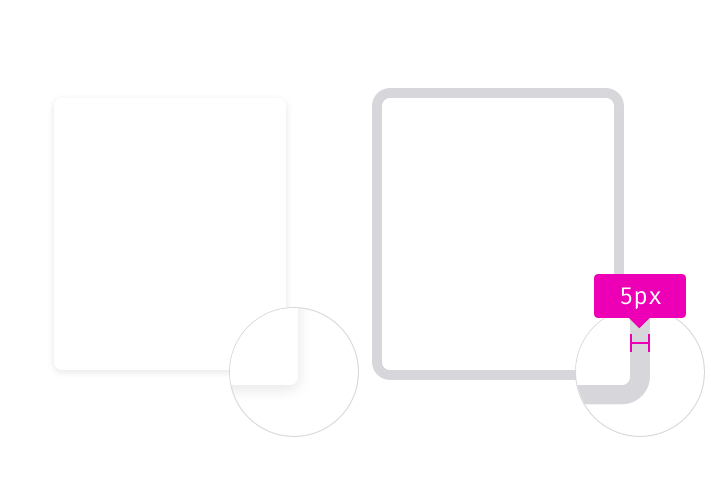
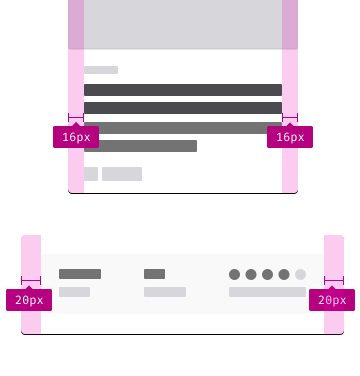

Card is a component to visually group related information and controls.

## Usage

When there are collections of images and components that need to be presented on the same page, use cards to help users quickly scan the information from collections to collections.

## Styles

### Borders

Border radius: `4px`

Highlight border: Grey 30 `#D7D7DB`, `5px` (outside)

### Shadow

Shadow is optional for cards.

If there’s a need of adding a shadow, use [shadow 10](../patterns/shadows.html) to highlight elevation.

### Padding

Use the same padding on the left & right to keep the visual balance.

Default padding: `16px`

Large padding: `20px`

