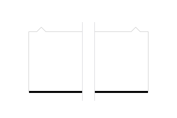

Doorhangers provide a way to present decisions to users which is less intrusive than a modal dialog.

## Usage

Doorhangers are used for prompt and notification; they are used for full featured UI; or they are used for list and menu as in the example on the left.

## Structure

### Directional Arrow

Doorhangers opening on the right side of the view show the directional arrow on the right.

Doorhangers opening on the left side of the view show the directional arrow on the left.

Never place the directional arrow at the center of doorhangers.

## Style

### Background and Border Colors

Background: White `#ffffff`

Border Color: Grey 90 a20 `rgba(12, 12, 13, 0.2)`

### Corner Radius

On Windows doorhangers have sharp corners.

On macOS and Linux doorhangers have rounded corners.

Corner Radius: `2px`

### Shadows

Doorhangers appear above other in-view elements. Use [shadow 30](../patterns/shadows.html#style) to highlight elevation.

### Sizes

Directional Arrow Height: `9px`

Directional Arrow Margin Left: `16px`

Directional Arrow Width: `18px`

Maximum Height: `90%`

Maximum Width: `320px`

## Behavior

Clicking outside of the active area dismiss doorhangers.

When doorhangers content is longer than 90% of the view make the content vertically scrollable.
