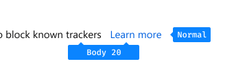

Link is text that users can select to access websites or subsequent pages.

## Usage

Use text links to guide users to a webpage or a content page in the browser or to anchor users to a section within a page. For an action that results in a change to Firefox, use a button instead. [See buttons](buttons.html)

## Types

### Internal link

An internal link directs users to a page inside the Mozilla properties (e.g., SUMO, Pocket) or anchors users to a specific section on the same page.

### External link

An external link directs users to a page not produced by or affiliated with Mozilla.

An [Open In New](http://design.firefox.com/icons/viewer/#open) icon should be paired with the external link.

## Styles

All platforms (except for Linux) follow the spec below. On Linux, use the system color for links.

### Typography

Font size: Same as the body text\\
Font weight: Normal

### Behaviors

**Normal**\\
Font color: Blue 60 `#0060df`

**Hover**\\
Font color: Blue 60 `#0060df`

**Pressed**\\
Font color: Blue 70 `#003eaa`

**Focused**\\
Box Shadow: `0 0 0 2px #0a84ff, 0 0 0 6px rgba(10, 132, 255, 0.3)`

## Placement

A link may stand alone after a sentence or an option. To highlight the relationship, place the link next to the sentence or option.





## Copy Rules

* Links should be sentence case when embedded in a sentence or when standing alone (e.g., Learn more).

* Do not use ellipses in a link to indicate that there is more information available at the destination. This should be assumed.

* Do not use punctuation at the end of the link, or navigation element unless you are using an exclamation point or question mark or the link is embedded in running text.
