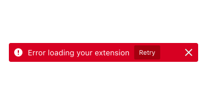
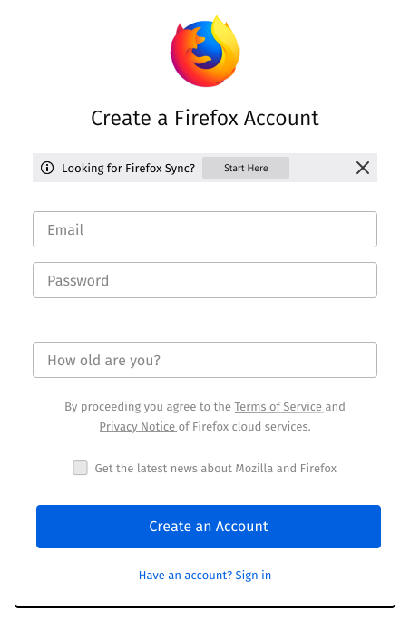

Message bars communicate specific information to a user. Display message bars at the top of the page or the section they apply to.

## Usage

Message bars contain concise and scannable text that is directly related to an action that has been completed or is about to be performed. They may include a single message or multiple messages. They should not be used to **Dismiss** or **Cancel**. It is **required** to have an icon precede the message(s).

Common use cases for message bars include: success messages, updates, warnings, problems and errors.

## Types

### Generic

Convey general information or actions that aren’t critical. Update users about a change or give them advice. Include lower priority information and should be dismissible.

### Success

Inform users when actions are successfully completed.

### Warning

Display exceptions or information the user needs to act on.

### Error

Communicate problems that must be addressed before a user can complete a task.

## Style



## Behavior

### Dismissible

Unless they contain critical information, message bars should be dismissible by clicking or tapping the ghost button, placed in the top right corner.

### Call to Action

Add one or two [micro-buttons](buttons.html#micro) to the message bar if users need to take an action after reading the message.



### Message on Multiple Lines

It is possible for the message to wrap to multiple lines. This is especially likely on mobile, or if displayed in a small container.

In this case the [icon](#icon) and the [dismiss-button](#dismissible) remain aligned to the top.

The [call-to-action-buttons](#call-to-action) break into a new line below the message and are aligned to the start of the message.
