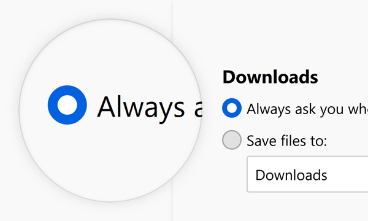
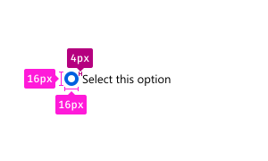
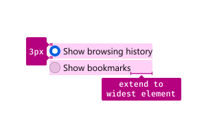

Radio buttons allow a selection of one option from a group of mutually exclusive options.

## Usage

Use radio buttons to provide people with a choice from a set of two to five mutually exclusive options. For example to offer a choice of how to save downloads.

## Combination

### Label Groups of Radio Buttons

Start every group of radio buttons with a label that defines what these options are about.

### Between 2-5 Choices



<figcaption>Combine radio buttons in groups of two to five mutually exclusive choices.</figcaption>



<figcaption>Never use one radio button on it’s own, consider using a checkbox instead.</figcaption>



<figcaption>For more than five choices, consider other options. Those could be a drop down or a reduction of choices.</figcaption>

### Always Exactly One Selected Choice

In any groups of radio buttons, one must always be selected. Do not use a group of radio buttons if no selected button is an option.





<figcaption>Once an option is selected, this state cannot be reached by the user again.</figcaption>

### Consider the Order of Choices

* Make the default the first choice if possible.

* If choices describe a range of impact to browsing behavior, order them from greatest impact to least impact. Do not force default to top if it breaks the sequence.

## Style

Radio Buttons consist of a part to indicate their state and a label to describe the choice it represents.

> Use the [Sketch Libary Component - Radio&#8209;Button](../images/components/radio-buttons/Photon Design System - Components - Radio-Buttons.sketch).

### Indicator & Label

Use the indicator to show whether the radio button is selected or not.

Use the label to make the choice clear.

### Dimensions

Corner Radius: `100%`

Height: `16px`

Width: `16px`

Horizontal Padding: `4px`

### Text and Color

Text: [Body 10](../visuals/typography.html#scale)

Text Color: Grey 90 `#0c0c0d`

## Behaviors

### Selected / Unselected

  

    

      

        

          <input name="group1" class="track-clicks" id="radio-01" checked="" type="radio">
          <label for="radio-01">Show browsing history</label>
        

        

          <input name="group1" class="track-clicks" id="radio-02" type="radio">
          <label for="radio-02">Show bookmarks</label>
        

      

    

  

  <figcaption>
    <a href="#" class="image-toggle" onclick="document.getElementById('showImage').style.display='block';
                                              document.getElementById('select-unselect-example').style.display='none';
                                              return false;">Image</a> /
    <a href="#" class="interactive-toggle" onclick="document.getElementById('showImage').style.display='none';
                                                    document.getElementById('select-unselect-example').style.display='block';
                                                    return false;">Interactive example</a> (Currently only renders correctly in Firefox.)
  </figcaption>

#### Selected:

Icon: [Radio-Button-Marker](../images/components/radio-buttons/radiobutton-marker-16.svg)

Background Color: Blue 60 `#0060df`

#### Unselected:

Background Color: Grey 90 a10 `rgba(12, 12, 13, 0.1)`

Border: 1px Grey 90 a30 `rgba(12, 12, 13, 0.3)`

### Clicktarget

A radio button can be selected by clicking on the area of its indicator as well as its label. Usually the clicktarget extends to the same width for each element in a collection of radio buttons. This results in a click target that extends beyond the label, for all elements shorter than the longest.

Clicking a radio button selects it on release of the click. If, during the click, the mouse is moved off of the radio button, it does not become selected.

### Interaction

#### Selected

Background Color:

Default: Blue 60 `#0060df`

Hover: Blue 70 `#003eaa`

Pressed: Blue 80 `#002275`

#### Unselected

Background Color:

Default: Grey 90 a10 `rgba(12, 12, 13, 0.1)`

Hover: Grey 90 a20 `rgba(12, 12, 13, 0.2)`

Pressed: Grey 90 a30 `rgba(12, 12, 13, 0.3)`

#### Focused

  

    

      

        When Nightly Starts
        

          <input name="group2" class="track-clicks" id="radio-focus-1" checked="" type="radio">
          <label for="radio-focus-1">Show your home page</label>
        

        

          <input name="group2" class="track-clicks" id="radio-focus-2" type="radio">
          <label for="radio-focus-2">Show a blank page</label>
        

        

          <input name="group2" class="track-clicks" id="radio-focus-3" type="radio">
          <label for="radio-focus-3">Show your windows and tabs from last time</label>
        

      

    

  

<figcaption>Interactive example (Currently only renders correctly in Firefox.)</figcaption>

Border: none

Box Shadow: `0 0 0 1px #0a84ff inset, 0 0 0 1px #0a84ff, 0 0 0 4px rgba(10, 132, 255, 0.3)`

## Copy Rules

* Use the imperative voice for radio button labels.
    
* Do not use terminal punctuation for radio button labels.
    
* Maintain parallel construction for lists of related radio button labels.
