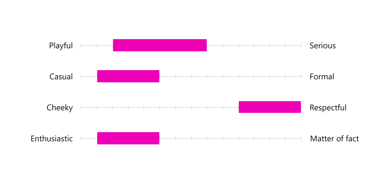

The primary job of the words in Firefox is helping users complete tasks and accomplish tasks, with no confusion and minimal interruption. But the words also offer a glimpse into Firefox’s personality. The voice and tone we use influence how people think and feel about Firefox. The words we choose — and the ways we use them — sound human because they reflect human goals: building trust, inspiring confidence, making things easier, and developing a relationship with Firefox users.

## Authentic Voice

Voice is a way to describe our point of view and reflect the Firefox personality. The Firefox voice guides our priorities for communicating with users. These aren’t the only things we care about, and we don’t always need to talk about them, but if the words in Firefox contradict our values, we appear inauthentic and risk our credibility.

Here are some of our core beliefs, ideas that help shape the Firefox voice:

* We make Firefox for people, not profit. That requires us to be open and honest, and offer a fair value exchange.
* We care about performance.
* We value user privacy.
* We believe users should have meaningful control of their browsing.

## Appropriate Tone

Our personal vocal tone varies with the situation — what we’re discussing, who we’re talking with, whether we’re calm or irritated. The Firefox tone works the same way, adjusting to align with a user’s need or state of mind. One way to look at tone is as a set of ranges along a continuum.

For areas where supporting the user is critical, like error messages or preference pages, our tonal ranges might appear like:

<figcaption>A more serious and respectful tone is used for critical support messages</figcaption>

For areas where we aim to direct and motivate users — like snippets, onboarding, and sync sign-up — our tonal ranges might appear like:

<figcaption>A playful yet respectful tone is used for directional and motivational messages</figcaption>

## Examples





