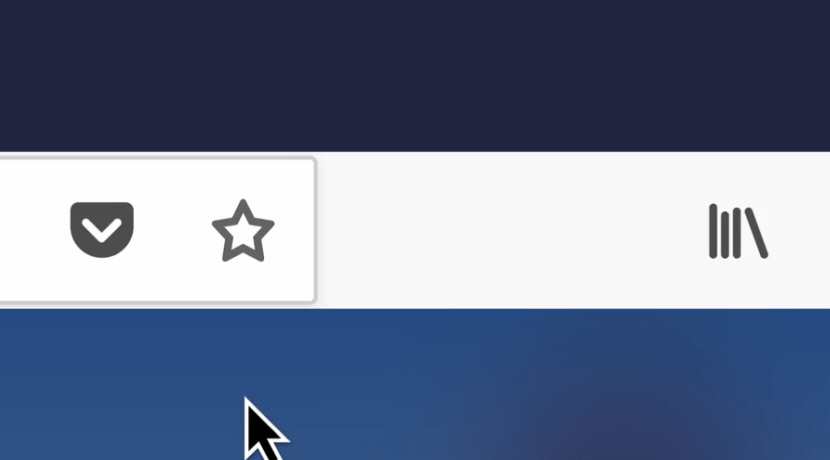

Icon animations have the greatest flexibility since the form and function of an icon can vary greatly. This is where we can inject the most personality and whimsy. With that said, here are a few guidelines to keep in mind.

## Bounce

Use this for on-press feedback when a user clicks on an icon to perform a unique task such as bookmarking or saving to Pocket. Do not use the bounce motion for common actions such as opening a door-hanger menu or library menu.

  

{:.animated}

Example of bounce.

## Highlight Colour

A highlight colour can be used to draw extra attention to an area.

{:.animated}

Example of highlight colour (Blue 60).

{:.animated}

## Confirmation Pop-up

Confirms the completion of a user triggered action (i.e. Copy Link and Bookmark This Page).

{:.animated}

Example of confirmation pop-up for Copy Link.

