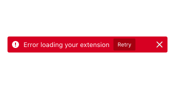

Errors (or error conditions) occur when the software fails to complete an expected action. Every error becomes a point of friction for the user.

## Usage

Error messages should provide essential information to help users understand and address issues, so they can recover quickly. Users gain understanding from the content of the messages (text, icons, color) as well as the context (where on the screen and when in the user flow the messages appear).

We distinguish between two different categories of error:

* User input errors
* System errors

### User input errors



### System errors



## Style

### Icon

The icon used for indicate errors is an exclamation mark enclosed within a circle, usually white on a [Red 60](../visuals/color.html#red) background, or [Red 60](../visuals/color.html#red).

### Colors

[Red](../visuals/color.html#red) is the dedicated color for errors states. Warning text should be legible, with noticeable contrast against its background color.

#### Background

Red 60 `#d70022`, or transparent

#### Content

White `#ffffff`, or Red 60 `#d70022`

## Copy rules

The best error messages are those that help users recover quickly. Remember that **recover** can mean more than **move to the next state of the application**. It can also mean **gain confidence by understanding why an issue occurred** or **gain reassurance that the error doesn't indicate a bigger issue or may continue to happen**.

* When the issue is a result of a user input error, simply offer a quick solution. There is no need to call out a user's mistake or assign a cause.

* When the issue is the result of system error, provide copy that explains the impact to the user, then explain the cause in clear terms, and finally explain how to resolve the issue. Note that while we do want to be accurate about errors, it is better to be **not wrong** than **completely technically accurate** so that we are helpful to the majority of users while not misspeaking to highly knowledgable users. Name the product in system errors to signal to users that errors are a software issue, not a user issue, i.e., Firefox cannot reach that page, but don't personify Firefox.

* Be brief, but not terse. Include signals to reassure users if appropriate.

* Guide users with the imperative voice (*Enter a valid email*) or the active voice (*Firefox is not responding*) where possible.