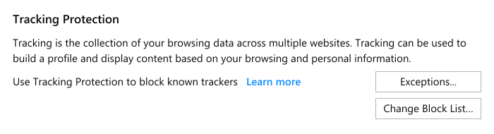

## Usage

Helpers provide extra information where the informational copy (e.g. settings descriptions) is not enough.

We distinguish between three different categories of helpers:

* Necessary
* Relevant
* Added value

## Necessary

We classified as **necessary** the information that will help all users anticipate interactions or prevent them from encountering an error.

Display necessary information with permanent inline tip.

## Relevant

We classified as **relevant** the information that is helpful to some users at a specific point in an interaction.

To disclose relevant information you may use modal windows, dismissable generic message bar, tooltip, on hover balloon.

## Added value

We classified as **added value** the information that satisfies user curiosity or answers key questions but is not critical to completing an interaction.

The entry point to added value information is often a link.

