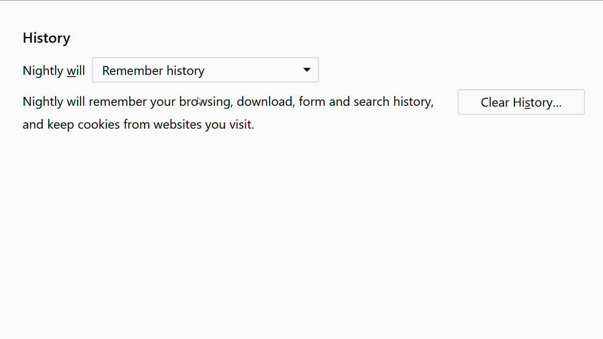

Use nesting to form a hierarchy that expresses that one element contains or determines the following elements.

This hierarchy is often used to indicate that some elements are only relevant if a given parent element is selected.

The most common forms to express this dependency are to:

* [disable nested elements](#disable-nested-elements)
* [hide nested elements](#hide-nested-elements)

<figcaption>Example of a disabled nested element</figcaption>

## Disable Nested Elements

<iframe height="180" src="{{ "/interactives/patterns/nesting/disable-hide-state_example.html" | prepend: site.baseurl }}" allowfullscreen="allowfullscreen" frameborder="0"></iframe>

<figcaption>Interactive Example for disabled sub elements in a set of checkboxes</figcaption>

Disable nested elements to help anticipate what enabling the parent will unlock, and to give additional context to the functionality of the parent.

## Hide Nested Elements

<iframe height="180" src="{{ "/interactives/patterns/nesting/hide-sub_example.html" | prepend: site.baseurl }}" allowfullscreen="allowfullscreen" frameborder="0"></iframe>

<figcaption>Interactive Example for hiding sub elements in a set of checkboxes</figcaption>

Hide the nested elements if showing them would overly complicate the interface, or occupy too much space in the UI.

Only use this if the visible part provides enough context for people to not be suprised by the additional content. Consider using sub-menues for hiding more information.

## Usage Examples

### Checkboxes

On Desktop checkboxes are often used in nested groups that disable parts of the options.

<video controls loop markdown="1">
  <source src="../images/patterns/nesting/nesting_example_fx_pref_disable.mp4" type="video/mp4" />

</video>

### Drop-down Lists

Like Checkboxes, Drop-down lists can be used to determine what content to show. In this case content stays hidden until the corresponding list entry is selected.

<video controls loop markdown="1">
  <source src="../images/patterns/nesting/nesting_example_fx_pref_hide.mp4" type="video/mp4" />

</video>

### Buttons <!-- should be it's own pattern menu -->

In a way, many buttons, like menus, also use nesting to hide content until pressed.

<video controls loop markdown="1">
  <source src="../images/patterns/nesting/nesting_example_fx_button.mp4" type="video/mp4" />

</video>
