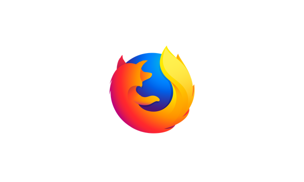
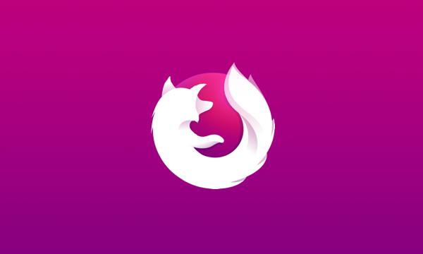
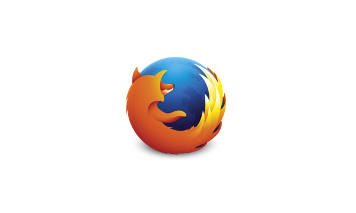

Firefox 57 marks the launch of a new product identity system that reflects the Photon design vision.  The first elements available in this system are the app icons for Firefox browsers and other Firefox-branded products.  These retain familiar elements of past app icons (like the fox and globe) but signal the profound changes in the product with bold colors and simplified shapes from the Photon Design System.

## Logo

[VIEW HIGH-RES](https://design.firefox.com/product-identity/firefox/firefox/firefox-logo.png)

All product icons are available for download as SVG, PDF and PNG.

> [
> Download all Firefox logos \\
> 2.6 MB (.zip)](https://design.firefox.com/product-identity/firefox-product-identity-assets.zip)

## Channel Variations

Each Firefox product’s release channel displays its own variation of the app icon.

### Firefox

<figcaption markdown="1">Download [.svg](https://design.firefox.com/product-identity/firefox/firefox/firefox-logo.svg), [.pdf](https://design.firefox.com/product-identity/firefox/firefox/firefox-logo.pdf), or [.png](https://design.firefox.com/product-identity/firefox/firefox/firefox-logo.png)
</figcaption>

### Firefox Beta

<figcaption markdown="1">Download [.svg](https://design.firefox.com/product-identity/firefox-beta/firefox-logo-beta.svg), [.pdf](https://design.firefox.com/product-identity/firefox-beta/firefox-logo-beta.pdf), or [.png](https://design.firefox.com/product-identity/firefox-beta/firefox-logo-beta.png)
</figcaption>

### Firefox Developer Edition

<figcaption markdown="1">Download [.svg](https://design.firefox.com/product-identity/firefox-developer-edition/firefox-logo-developer-edition.svg), [.pdf](https://design.firefox.com/product-identity/firefox-developer-edition/firefox-logo-developer-edition.pdf), or [.png](https://design.firefox.com/product-identity/firefox-developer-edition/firefox-logo-developer-edition.png)
</figcaption>

### Firefox Nightly

<figcaption markdown="1">Download [.svg](https://design.firefox.com/product-identity/firefox-nightly/firefox-logo-nightly.svg), [.pdf](https://design.firefox.com/product-identity/firefox-nightly/firefox-logo-nightly.pdf), or [.png](https://design.firefox.com/product-identity/firefox-nightly/firefox-logo-nightly.png)
</figcaption>

### Firefox Focus

<figcaption markdown="1">Download [.svg](https://design.firefox.com/product-identity/firefox-focus/firefox-logo-focus.svg), [.pdf](https://design.firefox.com/product-identity/firefox-focus/firefox-logo-focus.pdf), or [.png](https://design.firefox.com/product-identity/firefox-focus/firefox-logo-focus.png)
</figcaption>

## Using Icons with Firefox Wordmarks or Logos

### Standard Horizontal Lockup

<figcaption markdown="1">Download [.svg](https://design.firefox.com/product-identity/firefox/firefox-horizontal-lockup/firefox-logo-horizontal-lockup.svg), [.pdf](https://design.firefox.com/product-identity/firefox/firefox-horizontal-lockup/firefox-logo-horizontal-lockup.pdf), or [.png](https://design.firefox.com/product-identity/firefox/firefox-horizontal-lockup/firefox-logo-horizontal-lockup.png)
</figcaption>

Use app icons with Firefox and other product designators appearing to the right as the preferred lockup.

### Alternative Stacked Lockup

<figcaption markdown="1">Download [.svg](https://design.firefox.com/product-identity/firefox/firefox-stacked-lockup/firefox-logo-stacked-lockup.svg), [.pdf](https://design.firefox.com/product-identity/firefox/firefox-stacked-lockup/firefox-logo-stacked-lockup.pdf), or [.png](https://design.firefox.com/product-identity/firefox/firefox-stacked-lockup/firefox-logo-stacked-lockup.png)
</figcaption>

Use the Firefox icon with Firefox below when horizontal space is an issue. Use this lockup only for Firefox (the main product icon), and not for other channel icon variants or wordmarks.

### Icons as Logo

<figcaption markdown="1">Download [.svg](https://design.firefox.com/product-identity/firefox/firefox/firefox-logo.svg), [.pdf](https://design.firefox.com/product-identity/firefox/firefox/firefox-logo.pdf), or [.png](https://design.firefox.com/product-identity/firefox/firefox/firefox/firefox-logo.png)
</figcaption>

Use app icons as logos without wordmarks only when Mozilla and Firefox appear in close proximity to the icon.

### Icon as Glyph

<figcaption markdown="1">Download [.svg](https://design.firefox.com/product-identity/firefox-glyph/firefox-logo-glyph.svg), [.pdf](https://design.firefox.com/product-identity/firefox-glyph/firefox-logo-glyph.pdf), or [.png](https://design.firefox.com/product-identity/firefox-glyph/firefox-logo-glyph.png)
</figcaption>

Use the one color icon when you need to represent Firefox with less emphasis than found in the full color icon.

This can occur in situations where you need to match an existing style in certain UI contexts; for example the de-emphasized Firefox icon for product messaging found on the New Tab page.

It can also be used to represent Firefox in another environment with its own style requirements; for example the iOS Share sheet.

### Icons Dos and Dont’s



<figcaption>Use the icons provided, without modification</figcaption>



<figcaption>Reverse icons</figcaption>



<figcaption>Use just a portion of the icon</figcaption>



<figcaption>Use previous icons</figcaption>

## Additional Guidelines

Icons files containing our trademarks are available under the following licenses: vector logo files under [CC-BY 3.0](https://creativecommons.org/licenses/by-sa/3.0/) or later; bitmap logo files under [MPL 2](https://www.mozilla.org/en-US/MPL/2.0/). By using these, you agree that you will not:

* make an icon or lockup the most distinctive or prominent feature on a non-Firefox website, printed material or other content

* use our logos in a way that suggests any type of association or partnership with Mozilla or approval, sponsorship or endorsement by Mozilla (unless allowed via a license from us)

* use our logos in a way that is harmful, deceptive, obscene or otherwise objectionable to the average person

* use our logos on websites or other places containing content associated with hate speech, pornography, gambling or illegal activities

* use our logos to, or in connection with, content that disparages us or sullies our reputation.
