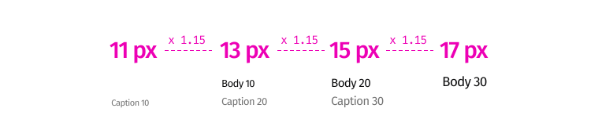
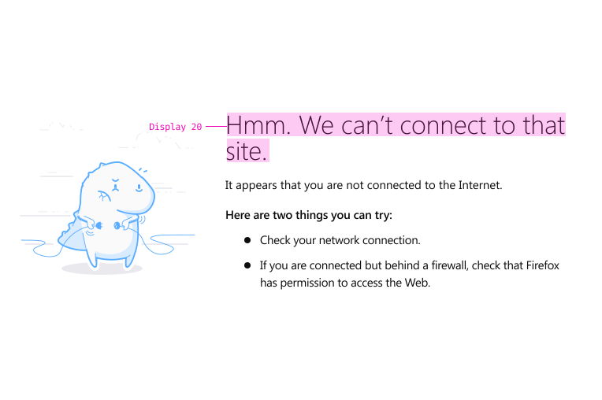
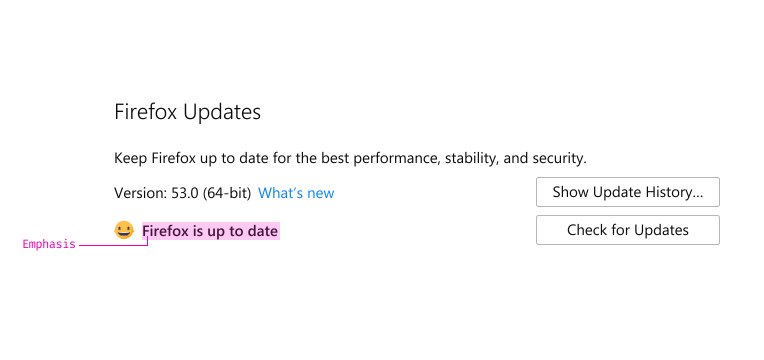

Good typography is invisible, enabling users to have a seamless experience while they're using Firefox products.

## Typefaces

In Firefox products we use the standard typeface for each platform.

<form></form>

## Scale

The type scale enables you to indicate content hierarchy. These sizes and styles are designed to balance content density with increased readability.

<form></form>

### The Scaling Ratio

The recommended font sizes, which are listed in the table above, are multiplied by a specific ratio for building the typographic hierarchy. In the very rare cases, there may be a need of having a bigger/ smaller font size which is not documented. Use the dedicated ratio to create new ones.

#### Body & Caption

<figcaption>The scaling ratio of body and caption is 1.15.</figcaption>

#### Title & Display

<figcaption>The scaling ratio of title and display is 1.29.</figcaption>

## Color

Choose a text color based on the content's purpose and priority.

### Primary Color

Use a primary color for main titles and body text.



### Secondary Color

Use a secondary color for accompanying text that adds further information, details, or features to the primary content. Examples include caption text and menu subtitles.



## Line Length

The number of characters per line influences readability. Studies indicate the following guidelines for English:

* **Satisfactory** \\
  45-75 characters (desktop) or 35-40 characters (mobile) per line is widely regarded as a satisfactory line length.

* **Optimal** \\
  Around 66 characters (desktop) or 39 characters (mobile) is optimal.

* **Too long** \\
  More than 90 characters (desktop) or 50 characters (mobile) is likely too long for continuous reading.

<figcaption>Line lengths within the light blue range are satisfactory, while entering the dark blue range are tolerant.</figcaption>

## Usage

### Display

Use display style for delivering primary messages on content pages.

<figcaption>Display 20 in an error page on Desktop</figcaption>

### Title

Use title style to summarize content that follows the title. Carefully pairing titles makes content hierarchy obvious and improves readability.

<figcaption>Title 30 pairing with Title 20 in Firefox Preferences on Desktop</figcaption>

### Emphasis

Use emphasized style on body text or a caption that needs to stand out from regular content.

<figcaption>Emphasize on "Firefox is up to date" in Firefox Preferences on Desktop</figcaption>

### Font Pairing

Font styles should typically be paired. But font styles may also be combined to indicate hierarchy or priority.

  
<figcaption>Style set 10 in Library menu on Desktop</figcaption>
